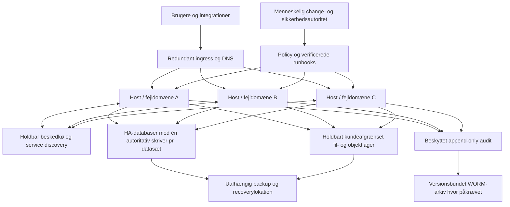

> Reference requirements only. For work assignment use ../prompts/DKC-XXX.md. References to earlier planning/handoff documents are historical context; this package requires direct implementation.

# Revision 3 — skalering, databevarelse, ITSM/ITSC og AI-immutable

Dato: 22. september 2026. Dette tillæg er en del af byggeplanen og et kravgrundlag for kodeagenterne. Det indeholder arkitekturforslag og acceptkrav; ingen af de nye funktioner er implementeret eller verificeret i repositoryet som del af denne planopdatering.

ITSC fortolkes her som IT Service Continuity: beredskab og genetablering af IT-services. Informationssikkerhed indgår også. Ved konflikt med den første plans enkle pilotmål gælder den vedtagne serviceprofil fra dette tillæg og DKC-037.

## 1. Det ønskede resultat

Platformen skal kunne køre over flere servere, flytte arbejde mellem dem og bevare data under den dokumenterede fejlmodel. AI-agenter håndterer overvågning, diagnose, servicearbejde og godkendt selvreparation. Mennesker ejer politikker, godkendelser, undtagelser og eskalationer.

Der er fire adskilte beskyttelser:

| Beskyttelse | Formål | Begrænsning |
|---|---|---|
| Høj tilgængelighed, HA | Fortsætte ved fejl på en server eller komponent | Afhænger af quorum, kapacitet og uafhængige fejldomæner |
| Replikering | Have løbende kopier af data | Kan også kopiere sletning og korruption |
| Backup og recovery | Genskabe tidligere konsistent tilstand efter tab eller kompromittering | Skal være uafhængig, komplet og afprøvet |
| AI-immutable | Forhindre AI i at ændre eller destruere beskyttede data | Kræver håndhævelse uden for AI's egne rettigheder |

Ingen af disse er alene et løfte om, at data aldrig kan gå tabt. I skal dokumentere præcis hvilke fejl hver profil tåler, og hvor meget data/tid en katastrofe kan koste.

## 2. Anbefalet deploymentmodel

**Pilot med HA:** ét HA-cluster over mindst tre uafhængige server-/fejldomæner, redundant indgang og vedvarende datalagre. Tre quorum-medlemmer eller tilsvarende managed service til kontrolplanet. Kritiske stateless-tjenester placeres med flere replikaer på forskellige hosts. Der skal være kapacitet til at drive de kritiske flows efter tab af én host, kaldet N+1.

Tre virtuelle maskiner på samme fysiske host er ikke tre uafhængige fejldomæner. Samme rack, strømforsyning, netværksudstyr eller fælles storage kan stadig være en fælles fejlårsag. DKC-037 dokumenterer den konkrete topologi og dens grænser. Kubernetes beskriver både quorum-baseret HA og forskellige kontrolplan-/etcd-topologier. [Kubernetes HA-topologier](https://kubernetes.io/docs/setup/production-environment/tools/kubeadm/ha-topology/).

**Recovery:** en adskilt lokation eller konto med selvstændig adgang, nødvendige backups og nøgler. Første version bruger et primært miljø og et recovery-miljø. Flere aktive datacentre med samtidige skrivere indføres kun, hvis den konkrete applikation og database har bevist støtte for det.

**Enterprise:** mulighed for dedikeret kundeinstallation, højere servicemål og eventuelt flere availability zones. Samme kontrakter skal gælde for delte og dedikerede installationer. En enkeltserverinstallation kan være understøttet non-HA-produktion med accepteret nedetid, ekstern backup og afprøvet recovery. Den må ikke sælges som HA. Se revision 3-tillægget for installationsprofiler.



Boksene med databaser, kø og storage er selv redundante services; de må ikke blive skjulte enkeltpunkter for fejl. Backupadministration og immutable-policy ligger i et andet rettighedsdomæne end AI-driften.

## 3. Kommunikation og konsistens

Tjenester finder hinanden via service discovery og kalder dokumenterede APIer. Brug verificeret bruger-/workload-identitet, krypteret trafik, kundeafgrænsede scopes, timeouts, begrænsede retries og circuit breakers. NetworkPolicy kræver et netværksplugin, som faktisk håndhæver politikkerne. En YAML-fil alene beviser ikke netværksisolering. [Kubernetes NetworkPolicy](https://kubernetes.io/docs/concepts/services-networking/network-policies/).

Længere opgaver og hændelser sendes via en holdbar kø. Design efter mindst én levering og gør modtagere idempotente: en besked kan komme igen efter en fejl. Kobl databaseændring og event med outbox/inbox, og kvittér først på det rigtige tidspunkt. Afsenderkvittering og modtagerkvittering beskytter forskellige dele af leveringen. [RabbitMQ om confirms og acknowledgements](https://www.rabbitmq.com/docs/confirms).

For opgaver med sideeffekter bruges leases og fencing-tokens, som modtageren validerer. En gammel worker må ikke fortsætte efter at have mistet sit ejerskab. Fordelte låse uden håndhævelse hos executor er utilstrækkelige.

| Data/flow | Konsistenskrav |
|---|---|
| Godkendelse, policyversion, budgetreservation og jobejerskab | Autoritativ beslutning uden stale replica-læsning |
| Bogførte eller andre kritiske transaktioner | Databasegaranti efter serviceklasse; bekræftede writes skal overleve den valgte HA-fejlmodel |
| Søgning, BI og cache | Må være forsinket efter aftale; aldrig bruge forsinkede adgangsdata til at udlevere beskyttet indhold |
| Audit | Holdbart intent før mutation, efterfølgende outcome og synligt unknown ved nedbrud |
| Filer | Vedvarende bytes, objektversion, metadata og rettigheder skal hænge sammen |

Synkron database-replikering kan reducere risikoen for tab af bekræftede transaktioner, mens asynkron replikering kan miste de seneste ændringer ved failover. Vælg eksplicit mellem tilgængelighed og at stoppe writes, hvis en nødvendig replika mangler. Beskyttelsen gælder den valgte topologi og fejlmodel, ikke alle tænkelige katastrofer. [PostgreSQL om standby og replikering](https://www.postgresql.org/docs/current/warm-standby.html).

## 4. Skalering skal gælde hver applikation

Gateway, portal, APIer og jobworkers skaleres vandret, når tilstanden er flyttet til fælles holdbare tjenester. Sessioner må ikke være afhængige af én proces. Autoskalering må tage højde for køalder, svartid, ressourceforbrug, databasekapacitet og budget.

Hvert upstreamprodukt skal deklarere én af profilerne: flere aktive replikaer, active/passive eller én aktiv instans med dokumenteret recovery. Flere pods gør ikke automatisk en app distribueret. Baggrundsjob, filsystemlåse, uploadmetadata, cron, licenser og databaseforbindelser skal indgå i appens skaleringstest.

Ved planlagt drain og deployment bruges readiness, topology spread og passende disruption budgets. Et disruption budget forhindrer ikke et fysisk hostnedbrud; dette skal testes særskilt. [Kubernetes om disruptions](https://kubernetes.io/docs/concepts/workloads/pods/disruptions/).

DKC-050 måler tre virksomhedsprofiler ved 1x, 2x og 5x repræsentativ belastning. Rapporten skal vise brugere, requests, jobs, data, p95/p99, fejlrate, køalder, replikeringslag og omkostning. Der loves ikke lineær vækst eller et bestemt antal brugere uden målinger.

## 5. Serviceklasser og mål

Følgende er foreslåede engineering-mål, som skal vedtages og testes i DKC-037. De er ikke en allerede leveret SLA. RPO er accepteret datatab målt i tid; RTO er tiden til at få det relevante brugerflow tilbage.

| Profil/fejl | Foreslået mål | Forudsætning |
|---|---|---|
| Kritisk kontroltilstand ved ét hosttab | RPO 0 for bekræftede writes; service tilbage inden fem minutter | Synkron durability, tilstrækkeligt quorum, fencing og N+1 |
| Kritiske data ved totalt primærsite-tab | RPO højst 15 minutter; RTO højst fire timer | Målt ekstern replika/backup/PITR-kæde; ellers ingen påstand om dette mål |
| Standarddata efter alvorlig korruption | RPO højst 24 timer; RTO højst fire timer | Kendt rent restorepunkt og appvalidering; renere punkt kan være ældre og kræve eskalation |
| Genopbyggelige caches/indeks | Kilden har sin egen serviceklasse; genopbygning måles | Ingen eneste kopi af kundedata må ligge her |
| Kritiske brugerflows i HA-pilot | SLO mindst 99,9 procent over 30 dages observation | Inkludér faktiske afhængigheder og forklar målemetode |

Hvis et mål ikke nås, skal profilen blokeres eller revideres af en menneskelig ejer. En indstilling i et manifest er ikke bevis for RPO 0. Større kunder kan kræve strengere mål eller højere pris.

## 6. Backup, recovery og deduplikering

Brug 3-2-1-1-0 som valgt designprincip: mindst tre kopier inklusive primærdata, mindst to lagrings-/fejldomæner, én kopi uden for primærlokationen, én offline eller immutable kopi og nul kendte fejl i den seneste relevante restoreverifikation. De præcise medier, konti og lokationer skal dokumenteres; tre snapshots i samme kompromitterbare konto opfylder ikke formålet.

En backup indeholder de nødvendige databaser, objekter, versionsmetadata, rettigheder, krypteringsnøgler, certifikater, konfiguration, manifest, images og katalogreferencer. Logisk konsistens på tværs af database og filobjekter skal sikres via den valgte apps backupmekanisme. Kubernetes-backupværktøjer kan indgå, men kræver valg af faktisk databeskyttelses- og recoverymetode. [Velero om disaster recovery](https://velero.io/docs/main/disaster-case/).

| Deduplikeringstype | Regel |
|---|---|
| Backupblokke/chunks | Brug en gennemprøvet motor; mål pladsbesparelse og verificér komplet restore |
| Primære filer/objekter | Valgfrit separat projekt; retention, referencer og integrity skal bevises før aktivering |
| Jobs/events | Idempotency fjerner utilsigtede gentagne sideeffekter |
| Kunder, kontakter og bilag | Datakvalitetsproces; opslag med samme tekst er ikke nødvendigvis samme forretningsobjekt |

Deduplikering sker som udgangspunkt inden for samme tenant, nøgle-/krypteringsdomæne og retentionklasse. Der må ikke opstå en sidekanal, hvor én kunde kan udlede, at en anden har en bestemt fil. Referencekatalog, nøgler og backupmanifest er selv kritiske data. En beskadiget delt chunk kan berøre flere snapshots og skal udløse præcis konsekvensrapport.

Prune/garbage collection skal tage hensyn til hold og alle levende referencer. Samspillet mellem dedupmotor og immutable storage skal testes: en backupløsning kan have brug for at omskrive eller slette metadata ved vedligeholdelse. Restics design illustrerer indholdsadresserede blobs og snapshots samt separat prune; det er en kandidatmekanisme, ikke et på forhånd valgt produkt. [restic design](https://restic.readthedocs.io/en/stable/100_references.html).

Restore skal foregå isoleret, finde et rent punkt, verificere integritet og genanvende relevante slettebeslutninger før åbning. Datatilsynet beskriver både behovet for komplet backup og procedurer, der sikrer fornyet sletning efter gendannelse. [Datatilsynet om backup](https://www.datatilsynet.dk/regler-og-vejledning/behandlingssikkerhed/katalog-over-foranstaltninger/backup).

## 7. ITSM og ITSC som arbejdsprocesser

AI-agenter udfører arbejdet gennem kontrollerede værktøjer, mens hver proces har en navngiven menneskelig ejer. Hver agent har præcis én rolle; processer med flere arbejdstrin fordeles mellem særskilte identiteter. Tabellen nedenfor beskriver en samlet proces, ikke én agents beføjelser. Ingen agent kan godkende. Følgende er vores ønskede procesdækning; tabellen er ikke en påstand om ITIL-certificering eller om fuld dækning i et bestemt ITSM-produkt. Procesfamilierne er i tråd med PeopleCerts oversigt over ITSM-kapabiliteter. [PeopleCerts kapabilitetsoversigt](https://atv.peoplecert.org/itsm-tool-capabilities-and-itil-service-delivery/).

| Proces | AI's arbejde | Menneskelig rolle | Opgaver |
|---|---|---|---|
| Servicekatalog og requests | Registrere, route og opfylde godkendte bestillinger | Eje service og godkendelsespolitik | 025, 044 |
| Monitoring og events | Korrelation, alarmkvalificering og diagnose | Eje tærskler og beredskab | 017, 049 |
| Incident management | Oprette sag, indsamle evidens og genoprette inden for runbook | On-call, eskalation og accept | 044, 046 |
| Major incident | Samle tidslinje, berørte tjenester og statusudkast | Incidentleder og kommunikationsansvarlig | 044, 052 |
| Problem/known error | Analysere gentagelser og foreslå permanent rettelse | Validere årsag og prioritet | 044 |
| Change enablement | Foreslå ændring, kontrollere konflikter og eksekvere autoriseret plan | Change authority og undtagelsesbeslutning | 045 |
| Release/deployment | Teste og rulle vedtaget artefakt ud | Eje frigivelse og risiko | 014, 038, 045 |
| Configuration/CMDB | Opdage ressourcer og vedligeholde relationer | Eje tjenestemodel og godkende kritiske ændringer | 044 |
| Asset management | Registrere udstyr, ejerskab og lifecycle | Eje aktiver og bortskaffelse | Eksisterende katalog og 044 |
| Knowledge management | Foreslå vejledninger fra verificerede forløb | Godkende autoritative runbooks | 028, 045 |
| Servicelevels og availability | Måle SLO/OLA og foreslå forbedring | Vedtage aftaler og acceptere afvigelser | 037, 050 |
| Capacity/performance | Prognoser, kvoter og godkendt skalering | Budget- og kapacitetsansvar | 034, 050 |
| Information security og access | Finde afvigelser og foreslå containment | Sikkerhedsansvarlig og privilegeret godkendelse | 003–012, 047–049 |
| Leverandører og licenser | Følge status, vilkår og udløb | Vurdere kontrakter og leverandørrisiko | 002, 019, 034 |
| Kontinuitet og DR | Forberede restore og køre autoriserede øvelser | BIA, katastrofeerklæring, recovery og failback | 037, 042, 052 |
| Løbende forbedring | Måle fejl, supporttid og runbookeffekt | Prioritere ændringer og udvidet autonomi | 032, 033, 052 |

GLPI kan undersøges som grundlag for ITSM/CMDB, men proceskrav og API/edition skal verificeres. Undgå at etablere parallelle sandheder i helpdesk, monitorering og kontrolplanet: brug fælles service-, incident-, change- og execution-IDer.

## 8. Menneskelig godkendelse og selvreparation

**Standard er godkendelse pr. muterende handling.** En menneskelig change authority kan aktivere snævre, versionsbundne standard-runbooks på forhånd. Det giver selvreparation uden at vente på et klik ved hver gentagelse, men kun inden for den godkendte grænse.

| Handling | Autorisation |
|---|---|
| Diagnose og læsning | Eksisterende læserettighed, dataklasse og adgangspolitik |
| Genstart af én stateless replika | Kan forhåndsgodkendes med min. raske replikaer, påvirkningsgrænse og tidsvindue |
| Skalering inden for interval | Kan forhåndsgodkendes med kvote, budget og kapacitetskontrol |
| Rollback til tidligere image | Kun forhåndsgodkendt hvis data/schema-kompatibilitet og tilbageførsel er bevist |
| Restore, større upgrade eller datamigration | Konkret menneskelig godkendelse i første produktversion |
| Databasepromotion ved almindeligt hosttab | Gennemprøvet deterministisk HA-controller under godkendt driftsprofil; AI må ikke improvisere quorum/fencing |
| Ny retention, beskyttelsespolitik eller AI-rettighed | Særskilt menneskelig proces; AI må ikke ændre A4-grænser |
| AI-immutable write/delete | Altid afvist for AI, også når en agent præsenterer en almindelig approval |

En runbook skal indeholde ID/version/digest, mål og tenant, tilladte parametre, forudsætninger, menneskelig godkender, udløb, maksimalt antal forsøg, cooldown, samlet ændringsbudget, nødvendige auditkvitteringer, stopkriterier, efterkontrol og konkret fallback. Første to healing-runbooks er en stateless restart og begrænset scale. Forsøgs- og tidsgrænser skal angives numerisk pr. runbook og testes.

```text
Signal -> incident -> diagnose -> godkendt runbook eller konkret approval
       -> policy + immutable-check + lease + varigt audit-intent
       -> afgrænset handling -> brugerflow-test -> observation
       -> succes eller autoriseret rollback/fallback -> menneskelig eskalation
```

Agenter kan ikke godkende hinanden som erstatning for mennesket. Et grønt AI-review er kun evidens. Manglende svar, tidspres og timeout er ikke approval. Gentagne fejl skal bruge et samlet budget pr. ressource/service, så flere agenter ikke skaber en reparationsstorm.

## 9. Fallback når noget går galt

| Fejl | Forventet adfærd |
|---|---|
| Model/provider utilgængelig | Ingen nye AI-mutationer; normale apps og allerede godkendte deterministiske controllers fortsætter efter deres egen politik |
| PDP, audit eller krævet approval-service utilgængelig | Stop nye agentmutationer; kontakt menneske via uafhængig kanal |
| Mistet ressourcelease | Stop den gamle worker; executor afviser gammelt fencing-token |
| Fejlet efterkontrol | Autoriseret rollback hvis sikker; ellers pause/isolation og menneske |
| Databasepartition | Én autoritativ writer eller stop writes; aldrig to konkurrerende primaries |
| Kritisk korruption/ransomware | Stop udbredelse efter godkendt containmentplan; mennesket vælger rent restorepunkt |
| Primærportal og IAM nede | Menneskelig recoveryadgang med separat kontrol, logning og kontaktliste |
| Usikker eller irreversibel ændring | Ingen påstået generel rollback; bevar evidens og eskalér |

At stoppe agentmutationer betyder ikke automatisk, at hele forretningens brugertrafik skal standses. Read-only eller isoleret drift vælges pr. service og må ikke åbne adgang til stale eller uautoriserede data.

## 10. Præcis betydning af AI-immutable

AI-immutable er et produktkrav, ikke en generel lagringsstandard. Vi definerer det som: AI-principals, deres delegerede tools og de driftsroller, de kan nå, kan ikke ændre eller destruere den beskyttede autoritative dataversion.

| Klasse | AI's adgang | Menneskelig ændring |
|---|---|---|
| Almindelig | Kun policy- og approvaltilladte operationer | Efter normal adgangskontrol |
| AI-read-only | Må læse hvis separat autoriseret; ingen mutation eller sletning | Autoriseret ejer kan ændre via særskilt proces |
| Append-only | Særskilt rolle kan tilføje nye events; kan ikke ændre historik | Forvaltet retentionproces; ikke almindelig redigering |
| Retention-locked/WORM | Ingen ændring/sletning af beskyttet version før frist | Afhænger af lagringsmode; en hård compliance-lås kan heller ikke ophæves af almindelig menneskelig godkendelse |
| No-AI-access-flag | Intet indhold til model, retrieval, prompts eller AI-analyse | Følger menneskets øvrige adgangsregler |

No-AI-access er et separat flag, som kan kombineres med de andre klasser. Nødvendig audit kan bruge opaque ressource-IDer og metadata uden det beskyttede indhold. AI-read-only betyder således ikke automatisk, at AI har ret til at læse indholdet.

Beskyttelsen skal dække overskrivning, sletning, ny version som skjuler den godkendte, ændring af current-pointer, omklassificering, lifecycle-regler, hold, restore over eksisterende data, dedup-prune, databaseadmin og destruktion af krypteringsnøgler. En AI med cluster-admin kan ellers omgå applikationens write-forbud. Derfor skal AI-drift være afgrænset til godkendte ressourcer; kontrol over trust, immutable-storage og nøgler ligger uden for dens rolle.

Ved recovery af beskyttede data kan AI udarbejde planen, men en nødvendig beskyttet skriveoperation skal gå gennem en særskilt menneskestyret recoveryautoritet. En almindelig agentapproval giver ikke adgang. Deterministiske backup-/lagerprocesser kan have snævre vedligeholdelsesrettigheder uden at udlevere indhold til modellen; det skal være særskilte identiteter, og agenten må ikke kunne ændre deres program, parametre eller destination til en dataudlevering. Beskyttelse mod indholdsændring er ikke i sig selv en garanti mod driftsafbrydelse eller fysisk ødelæggelse af alle kopier.

Object Lock kan give WORM-beskyttelse på en objektversion. Governance- og compliance-mode har forskellige bypassmuligheder, og beskyttelsen af en version forhindrer ikke nødvendigvis oprettelse af en anden version. Platformen skal derfor fastholde autoritativt versions-ID og beskytte kataloget. S3-kompatible produkter skal testes for deres egne garantier. [Object Lock og retention-modes](https://docs.aws.amazon.com/AmazonS3/latest/userguide/object-lock.html).

WORM alene beskytter ikke mod tab eller sletning af krypteringsnøgler. Backup, key recovery og separation af KMS-administration er derfor en del af samme krav. [Object Lock og krypteringsnøgler](https://docs.aws.amazon.com/AmazonS3/latest/userguide/object-lock-managing.html).

Mennesker skal fortsat kunne håndtere lovlig berigtigelse, retention og sletning, når det er tilladt. Brug versioneret berigtigelse eller en særskilt sletteproces frem for at give AI skriveadgang. Låsens varighed og dataklasse skal vurderes før persondata skrives; immutable må ikke bruges som automatisk begrundelse for evig opbevaring. [Datatilsynet om sletning](https://www.datatilsynet.dk/regler-og-vejledning/behandlingssikkerhed/sletning).

## 11. Fuld logging betyder et komplet revisionsspor

For hver hændelse og handling registreres tenant, service, ressource, incident, change, execution, tid, aktør, model/provider/promptversion, datakilder, korte beslutningsbegrundelser, policyresultat, menneskelig approval eller runbookdigest, redigerede toolparametre, før/efter-reference, resultat, retries, fallback og eskalation.

Loggen skelner mellem et modeludsagn og et målt resultat. Den skal være holdbar før mutation, beskyttet mod agentens redigering og kunne følges på tværs af hosts. Tidsynkronisering suppleres med entydige IDer og sekvenser; timestamps alene er ikke global hændelsesrækkefølge.

Komplet logging betyder ikke at gemme passwords, tokens, alle rå persondata eller modellens skjulte interne ræsonnering. Gem den nødvendige forklaring, de faktiske værktøjshandlinger og evidens med passende adgang og retention. Angreb eller menneskelig recovery efter totalt logudfald dokumenteres gennem særskilt beredskabsprocedure; AI får ingen ulogget nødvej.

## 12. Obligatorisk fejlmatrix før HA-/self-healing-frigivelse

| Test | Forventet resultat |
|---|---|
| Sluk én worker | Workload overtages; vedvarende data og tilladelser bevares |
| Sluk én kontrolplannode | Quorum og serviceprofil holder |
| Tab af quorum | Ingen konkurrerende kontrol eller usikre writes |
| Netværkspartition mellem databasehosts | Fencing sikrer højst én autoritativ writer |
| Kill primary efter commitkvittering | Kvitterede writes bevares i den vedtagne HA-fejlmodel |
| Tab af ingress/DNS-instans | Resterende indgang virker |
| Fuld disk og overfyldt kø | Kontrolleret backpressure; ingen falsk succes |
| Stale, dobbelt eller ombyttet event | Ingen utilsigtet gentagen sideeffekt |
| Worker dør efter mutation før ack | Outcome reconciles; ingen blind retry |
| Silent corruption | Integritetskontrol opdager fejl og viser påvirkede data |
| Backupjob siger succes, restore er defekt | Release blokeres; backup tæller ikke som brugbar |
| Crash under dedup-prune | Beskyttede snapshots og metadata kan gendannes |
| AI forsøger delete, key destruction eller pointer-skift | Afvisning på relevant storage-/identitetslag og audit |
| AI forsøger no-AI-access via søgning eller logs | Intet beskyttet indhold udleveres |
| To agenter healer samme service | Lease/fencing og samlet budget begrænser handlingerne |
| Governance/audit/provider nede | Nye AI-mutationer stopper; menneskelig eskalation virker |
| Rollback er inkompatibel med nyt schema | Rollback blokeres; kontrolleret fallback og menneske |
| Tab af hele primærsite inklusive IAM | Recovery i andet miljø, målte RPO/RTO og uafhængig menneskelig adgang |
| Restore indeholder tidligere slettede persondata | Slettejournal og privacy-kontrol anvendes før frigivelse |
| Failback til primærsite | En autoritativ datakilde, kontrolleret cutover og valideret integritet |

Fejl skal fremkaldes på isoleret staging med syntetiske data. DKC-051 producerer HA-/fejlmatrix-evidensen, og DKC-052 beviser menneskelig overtagelse. DKC-033 må ikke frigive en HA-pilot før begge består. En single-serverprofil kræver fælles sikkerheds-/recoverygates fra DKC-062 samt separat menneskelig overtagelsesøvelse ved selvreparation; den kan ikke arve HA-evidens. Se tillæg 06.

## 13. Nye opgaver og rækkefølge

DKC-037–052 er tilføjet som 16 nye opgaver. De er fordelt ind i de eksisterende faser og udgør krav før den relevante produktionsprofil kan aktiveres. Opgavenumre angiver identitet, ikke en ren numerisk kørselsrækkefølge.

Efter DKC-002 kan DKC-037 begynde. Basissikkerhed DKC-003–012 fortsætter. DKC-038–043 bygger HA, data og recovery oven på staging. DKC-047–048 fastlægger og håndhæver beskyttelsesklasser før nye apps frigives. DKC-044–046 etablerer ITSM, godkendte runbooks og selvreparation. DKC-049–052 leverer revisionsspor, skaleringstest, fejløvelser og menneskelig overtagelse.

Den præcise afhængighedsgraf i `opgaver.json` er autoritativ for planlægningen. Ingen agent må opfatte disse krav som tilladelse til at deploye til kundernes produktion eller ændre data under planlægningsarbejdet.
